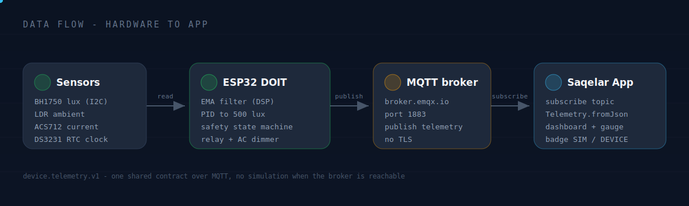
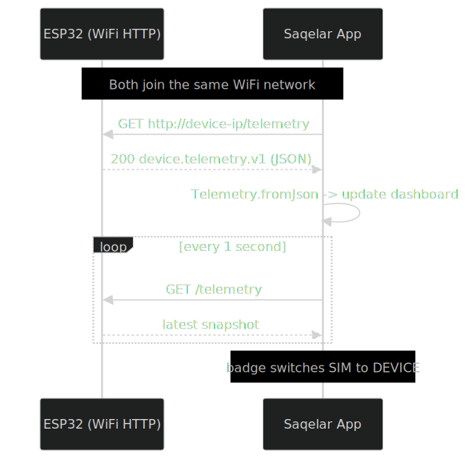

<p align="center">
  
</p>

<p align="center">
  
  
  
  
</p>

<p align="center">
  <a href="https://github.com/GifariKemal/anggie-smart-light/releases/latest/download/saqelar-v0.7.0.apk">
    
  </a>
  <a href="https://github.com/GifariKemal/anggie-smart-light/releases/latest">
    
  </a>
  
</p>

<p align="center">
  <b>Smart lighting that holds a target brightness on its own, and a control room in your pocket.</b><br>
  ESP32 PID lux control firmware plus a Flutter dark dashboard, joined by one WiFi telemetry contract. 💡
</p>

---

## 📑 Table of contents

| Section | What is inside |
| :-- | :-- |
| [Overview](#-overview) | What this project does and why |
| [Highlights](#-highlights) | Feature matrix at a glance |
| [Architecture](#-architecture) | System map and live data flow |
| [Repository layout](#-repository-layout) | Where everything lives |
| [Quick start](#-quick-start) | Build firmware and run the app |
| [How hardware talks to the app](#-how-hardware-talks-to-the-app) | The integration sequence |
| [Screens](#-screens) | UI walkthrough |
| [Tech stack](#-tech-stack) | Tools and libraries |
| [Roadmap](#-roadmap) | What is done and what is next |
| [Documentation](#-documentation) | Deep dive guides |
| [Credits](#-credits-and-license) | Authors and license |

---

## 🔭 Overview

Anggie is a closed loop smart light. The firmware reads real lux from a BH1750 sensor and drives an AC dimmer with a PID controller so the work area stays near a target of 500 lux, day and night, while a safety state machine protects the load. The Flutter app turns that device into a clean dark "control room" dashboard for live monitoring.

The two halves share a single JSON contract called `device.telemetry.v1`. The app reads real device data over WiFi when the hardware is connected, and falls back to a built in simulator when it is not, so the app is always demonstrable.

> 🧪 Status: firmware compiles clean for the DOIT board (0 error, 0 warning). The app runs as a release build on real Android hardware. Live hardware link is ready and waiting for the device to be wired.

---

## ✨ Highlights

| Area | Capability |
| :-- | :-- |
| 🎛️ Control | PID lux control toward 500 lux, dimmer capped at 80 percent for anti flicker |
| 🧮 Signal | Exponential moving average (EMA) filtering on light and current readings |
| 🛟 Safety | State machine: PID active, night mode, daylight off, overcurrent trip at 5 A |
| 🌙 Schedule | Static 40 percent night mode between 22:00 and 06:00 from the RTC clock |
| 📡 Telemetry | `device.telemetry.v1` over Serial and MQTT (one JSON topic) |
| 📱 App | Dark control room UI, animated lux gauge, trends, PID and safety panels |
| 🔌 Integration | App subscribes to the MQTT topic and switches the badge from SIM to DEVICE |
| ♿ Quality | Accessibility, reduced motion, sound and haptics, clean static analysis |

---

## 🧭 Architecture

<p align="center">
  
</p>

<p align="center">
  
</p>

The safety state machine inside the firmware decides everything downstream:

<p align="center">
  
</p>

---

## 🗂️ Repository layout

```text
Anggie/
├─ Anggie.ino                     ESP32 firmware (v0.2.0)
├─ Apps/saqelar/saqelar/saqelar/  Flutter app (Saqelar)
│  ├─ lib/                        screens, widgets, services, models
│  └─ assets/                     fonts, sfx, launcher icon
├─ backend-saqelar/               optional contract harness (not used at runtime)
├─ docs/                          documentation and screenshots
│  ├─ FIRMWARE.md  APP.md  INTEGRATION.md  ARCHITECTURE.md
│  ├─ assets/                     svg banners and diagrams
│  └─ flow/                       end to end screenshots
├─ LICENSE
└─ README.md
```

---

## 🚀 Quick start

### Firmware 🔧

```powershell
# board: DOIT ESP32 DEVKIT V1
arduino-cli compile --fqbn esp32:esp32:esp32doit-devkit-v1 --warnings all .
arduino-cli upload  --fqbn esp32:esp32:esp32doit-devkit-v1 -p COM5 .
```

No WiFi credentials in code. On first boot the device opens a `Anggie-Setup` captive portal so you pick your WiFi from a phone, then it connects to the MQTT broker. Full guide in [docs/FIRMWARE.md](docs/FIRMWARE.md).

### App 📱

```powershell
cd Apps/saqelar/saqelar/saqelar
flutter pub get
flutter run            # debug on a connected device
flutter build apk --release
```

Full guide in [docs/APP.md](docs/APP.md).

---

## 🔗 How hardware talks to the app

<p align="center">
  
</p>

The app side lives in `lib/services/device_simulator.dart` (MQTT subscribe and fallback) and `lib/models/telemetry.dart` (the parser). The device side is the MQTT publish block in `Anggie.ino`. Details in [docs/INTEGRATION.md](docs/INTEGRATION.md).

---

## 🖼️ Screens

A full eleven step walkthrough with screenshots lives in [docs/flow/README.md](docs/flow/README.md): splash, onboarding, dashboard, control panel, and the fault alarm takeover.

| Stage | Highlight |
| :-- | :-- |
| 🟢 Splash | Boot bar with INIT, LINK, READY stages |
| 🟢 Dashboard | Animated lux gauge with ticks and target notch |
| 🟢 Control | Mode selector, target and PID sliders, demo scenarios |
| 🔴 Fault | Red vignette, alarm sound, relay off, OVERCURRENT badge |

---

## 🧰 Tech stack

| Layer | Tools |
| :-- | :-- |
| Firmware | Arduino C++, ESP32 core 3.x, PubSubClient, ArduinoJson, RBDdimmer, BH1750, ACS712, RTClib |
| App | Flutter, Dart, FiraSans and FiraMono, mqtt_client, audioplayers, shared_preferences |
| Transport | WiFi station, MQTT (public broker, no TLS), JSON |
| Tooling | arduino-cli, flutter, gradle, ffmpeg for sound assets |

---

## 🗺️ Roadmap

| Status | Item |
| :-: | :-- |
| ✅ | Firmware v0.2.0 with EMA, state machine, night mode |
| ✅ | Telemetry contract over Serial and MQTT (single topic) |
| ✅ | Flutter dark dashboard with live and simulated sources |
| ✅ | App device connection screen and auto switch |
| ✅ | Two way control over the MQTT command topic (mode, target, dimmer, PID) |
| ⬜ | Live test on wired hardware |
| ⬜ | Historical logging and charts persistence |

---

## 📚 Documentation

| Guide | Focus |
| :-- | :-- |
| [docs/ARCHITECTURE.md](docs/ARCHITECTURE.md) | System design and data flow |
| [docs/FIRMWARE.md](docs/FIRMWARE.md) | Pins, parameters, build and flash |
| [docs/APP.md](docs/APP.md) | Flutter app structure and design system |
| [docs/INTEGRATION.md](docs/INTEGRATION.md) | Contract, endpoints, and wiring the app |
| [docs/flow/README.md](docs/flow/README.md) | Screenshot walkthrough |

---

## 👤 Credits and license

Built by **Gifari Kemal Suryo**, CEO and Founder of **PT Surya Inovasi Prioritas (SURIOTA)**. 🚀

Released under the [MIT License](LICENSE). You are free to use, modify, and distribute with attribution.

<p align="center">
  <sub>© 2026 PT Surya Inovasi Prioritas (SURIOTA). Made with care for reliable lighting. 💡</sub>
</p>
