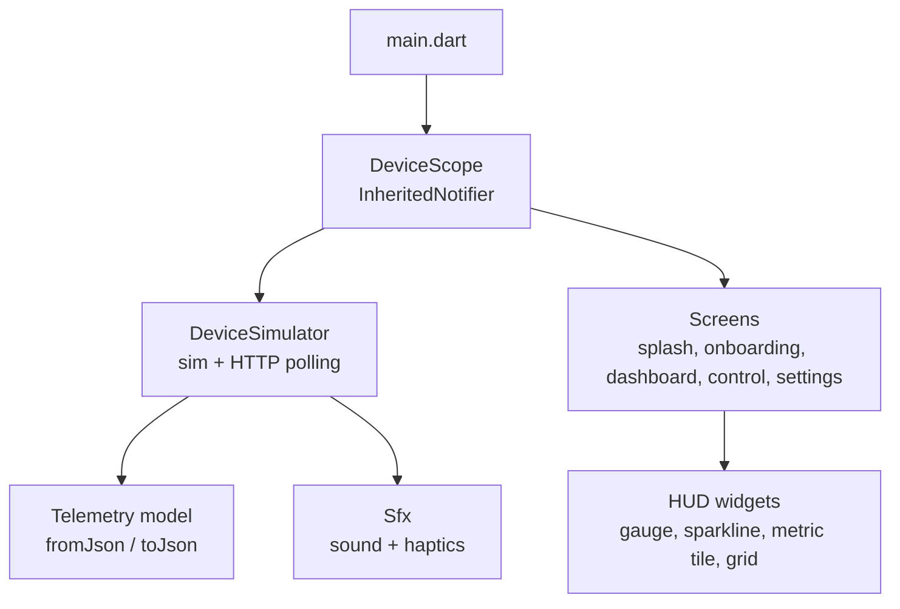
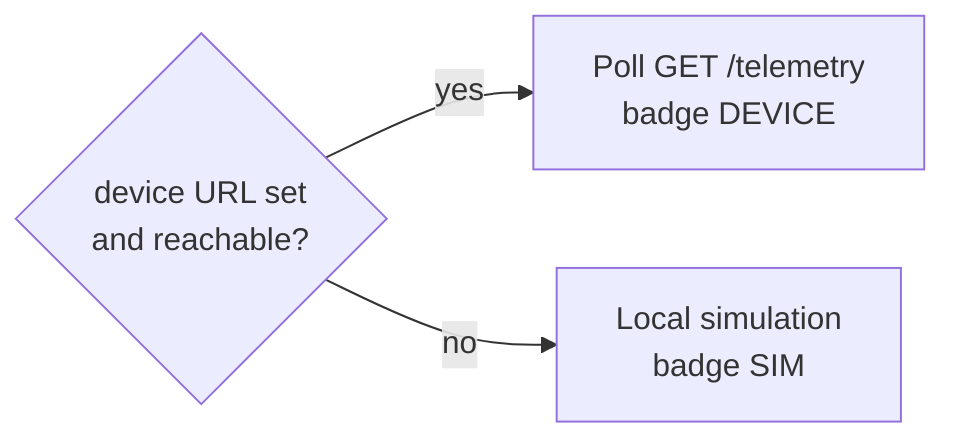

<p align="center">
  
</p>

<h1 align="center">📱 App Guide (Saqelar)</h1>

<p align="center">
  
  
  
</p>

Saqelar is the Flutter front end for Anggie. It presents the device as a dark "control room" dashboard with an animated lux gauge, live trends, PID and safety panels, and a control surface. It reads real device data over WiFi and uses a built in simulator when no device is connected.

---

## 📋 Table of contents

| Section | Content |
| :-- | :-- |
| [Design system](#-design-system) | Colors, type, motion |
| [Screens](#-screens) | Every screen and its job |
| [Code structure](#-code-structure) | Modules and responsibilities |
| [Data source](#-data-source) | Live device and simulator |
| [Build and run](#-build-and-run) | Commands |
| [Quality](#-quality) | Accessibility and testing |

---

## 🎨 Design system

| Token | Value | Use |
| :-- | :-- | :-- |
| Background | `#0F172A` | Deep slate canvas |
| Surface | `#1E293B` | Cards and panels |
| Accent | `#22C55E` | Status ok, live, on |
| Warning | `#F59E0B` | Standby, night |
| Danger | `#EF4444` | Fault |
| Info | `#38BDF8` | Neutral data |
| Display font | FiraSans | Labels and headings |
| Mono font | FiraMono | All numeric HUD values |

The single green accent doubles as the firmware `safetyState` of `ok`. Numbers use a monospace face for a tidy instrument feel. Motion respects the system reduced motion setting.

---

## 🧱 Screens

| Screen | Purpose |
| :-- | :-- |
| 🟢 Splash | Brand boot bar with INIT, LINK, READY stages |
| 🟢 Onboarding | Three slides with a live telemetry preview card |
| 🟢 Dashboard | Lux gauge, dimmer bar, metrics, trends, PID, safety guard |
| 🟢 Control panel | Mode selector, target and PID sliders, demo scenarios |
| 🟢 Settings | Device connection, source switch, status |

A full screenshot tour is in [flow/README.md](flow/README.md).

---

## 🗃️ Code structure



| Path | Responsibility |
| :-- | :-- |
| `lib/app/app_theme.dart` | Theme tokens, radius scale, motion helper |
| `lib/models/telemetry.dart` | Contract model, `FirmwareConstants`, JSON |
| `lib/services/device_simulator.dart` | Telemetry source, simulation, HTTP polling |
| `lib/services/device_scope.dart` | Provider via InheritedNotifier |
| `lib/services/sfx.dart` | Sound effects and haptics |
| `lib/widgets/hud_widgets.dart` | Gauge, sparkline, metric tile, grid background |
| `lib/screens/` | Splash, onboarding, dashboard, control, settings |

---

## 🔌 Data source

The app has one source object that can run in two modes:



Set the device URL in the Settings screen. When the poll succeeds the dashboard shows real values and the simulation pauses. When it fails the app keeps working in simulation. The URL is saved with `shared_preferences`.

---

## 🏃 Build and run

```powershell
cd Apps/saqelar/saqelar/saqelar
flutter pub get
flutter analyze
flutter test
flutter run                 # debug on a connected device
flutter build apk --release # release build
```

> 💡 The app needs cleartext HTTP for the local device link. This is already enabled in the Android manifest for the LAN use case.

---

## ♿ Quality

| Check | Status |
| :-- | :-- |
| Static analysis | No issues found |
| Unit tests | Telemetry getters, safety palette, `fromJson` |
| Accessibility | Semantic labels, reduced motion, text scaling clamp |
| Touch targets | Minimum 48 dp on primary controls |
| Color use | Status backed by text, not color alone |

---

<p align="center">
  <sub>© 2026 PT Surya Inovasi Prioritas (SURIOTA). Author: Gifari Kemal Suryo. MIT License.</sub>
</p>
