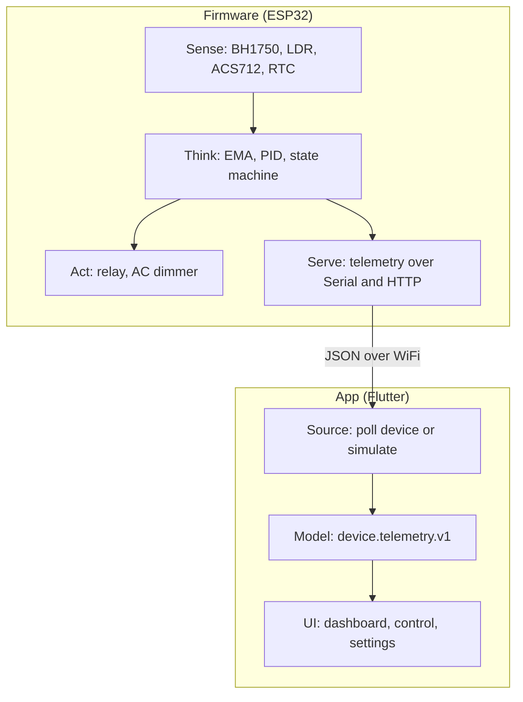
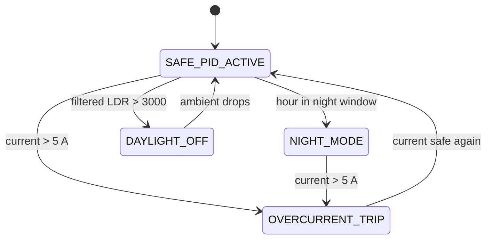
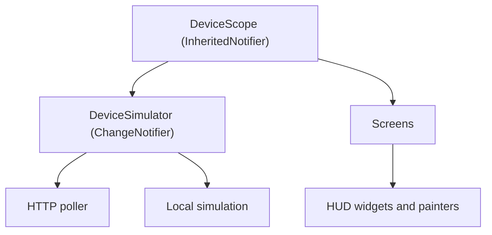

  

<h1 align="center">🧭 Architecture</h1>

  
  

A high level view of how Anggie is put together, from the silicon to the screen.

---

## 📋 Table of contents

| Section | Content |
| :-- | :-- |
| [System map](#-system-map) | The big picture |
| [Components](#-components) | Each part and its role |
| [The shared contract](#-the-shared-contract) | One model on both sides |
| [Control loop](#-control-loop) | How the device decides |
| [App layers](#-app-layers) | How the UI is organized |
| [Design principles](#-design-principles) | The rules we follow |

---

## 🗺️ System map

  

---

## 🧩 Components

| Layer | Element | Responsibility |
| :-- | :-- | :-- |
| Sense | BH1750, LDR, ACS712, DS3231 | Measure lux, ambient, current, time |
| Think | EMA filter, PID, state machine | Smooth, control, and protect |
| Act | Relay, AC dimmer | Switch and dim the lamp |
| Serve | Serial, WiFi HTTP | Publish telemetry |
| Source | DeviceSimulator | Poll the device or simulate locally |
| Model | Telemetry, FirmwareConstants | Parse and hold the contract |
| UI | Screens and HUD widgets | Present and interact |

---

## 🤝 The shared contract

Both sides speak `device.telemetry.v1`. The firmware writes it with ArduinoJson. The app reads it with `Telemetry.fromJson`. The numeric limits live in one place per side and are kept in sync.

| Concept | Firmware | App |
| :-- | :-- | :-- |
| Target lux | `SETPOINT` 500 | `defaultTargetLux` 500 |
| Overcurrent | `MAX_SAFE_CURRENT` 5000 mA | `maxSafeCurrentMa` 5000 |
| Daylight cutoff | `LDR_DAYLIGHT` 3000 | `ldrDaylightRaw` 3000 |
| Dimmer ceiling | `DIMMER_CEILING` 80 | `dimmerMaxPct` 80 |
| Night window | 22 to 6 | `nightStartHour` to `nightEndHour` |

This is the single most important rule of the project. One contract, two faithful implementations.

---

## 🔁 Control loop

Safety always wins. Remote commands, when they arrive, will be advisory and the device keeps final authority.

---

## 🧱 App layers

State flows from one notifier down through an inherited widget, so screens rebuild on each telemetry tick while custom painters stay isolated with repaint boundaries.

---

## 🎯 Design principles

| Principle | In practice |
| :-- | :-- |
| One contract | `device.telemetry.v1` on both sides |
| Safety first | The device, not the app, controls the relay |
| Always demonstrable | Simulator fallback when no hardware |
| Minimal footprint | Standard library and platform features before new dependencies |
| Honest UI | Status shown with text and icon, not color alone |

---

  © 2026 PT Surya Inovasi Prioritas (SURIOTA). Author: Gifari Kemal Suryo. MIT License.

