<p align="center">
  
</p>

<h1 align="center">🔧 Firmware Guide</h1>

<p align="center">
  
  
  
</p>

ESP32 firmware (`Anggie.ino`) for a closed loop smart light. It keeps a work area near a target brightness with a PID controller, filters noisy sensors, protects the load with a safety state machine, and publishes telemetry over Serial and MQTT.

---

## 📋 Table of contents

| Section | Content |
| :-- | :-- |
| [Hardware](#-hardware) | Components and wiring |
| [Pin map](#-pin-map) | ESP32 pin assignments |
| [Parameters](#-parameters) | Tunable constants |
| [Control logic](#-control-logic) | EMA, PID, and state machine |
| [Telemetry](#-telemetry-contract) | The shared JSON contract |
| [Build and flash](#-build-and-flash) | arduino-cli commands |
| [WiFi setup (captive portal)](#-wifi-setup-captive-portal) | On device WiFi and MQTT config |
| [Serial output](#-serial-output) | What you see on the monitor |
| [Safety](#-safety-notes) | High voltage warning |

---

## 🧩 Hardware

| Component | Role | Bus |
| :-- | :-- | :-- |
| ESP32 DOIT DEVKIT V1 | Main controller | - |
| BH1750 | Digital lux sensor | I2C |
| LDR | Ambient light, feed forward | Analog |
| ACS712 | AC current sensing | Analog |
| DS3231 RTC | Real time clock for night mode | I2C |
| Relay module | Master cut off | Digital |
| AC dimmer (zero cross) | Phase control of the lamp | Digital |

---

## 📌 Pin map

| ESP32 pin | Name | Function |
| :-- | :-- | :-- |
| GPIO34 | `ACS_PIN` | ACS712 analog input |
| GPIO35 | `LDR_PIN` | LDR analog input |
| GPIO25 | `RELAY_PIN` | Relay output (active HIGH) |
| GPIO26 | `ZC_PIN` | Dimmer zero cross input |
| GPIO33 | `DIM_PIN` | Dimmer trigger output |
| GPIO21 | SDA | I2C data (BH1750, RTC) |
| GPIO22 | SCL | I2C clock (BH1750, RTC) |

> 💡 GPIO34 and GPIO35 are input only, which suits analog sensors. I2C runs at 50 kHz for noise tolerance on long wiring.

---

## ⚙️ Parameters

| Constant | Value | Meaning |
| :-- | :-- | :-- |
| `SETPOINT` | 500 lux | PID target brightness |
| `Kp` / `Ki` / `Kd` | 0.15 / 0.05 / 0.01 | PID gains |
| `DIMMER_CEILING` | 80 percent | Anti flicker dimmer cap |
| `MAX_SAFE_CURRENT` | 5000 mA | Overcurrent trip at 5 A |
| `LDR_DAYLIGHT` | 3000 | Daylight cutoff on filtered LDR |
| `NIGHT_DIMMER` | 40 percent | Static brightness at night |
| `NIGHT_START_HOUR` / `NIGHT_END_HOUR` | 22 / 6 | Night window |
| `ALPHA_LDR` / `ALPHA_CURRENT` | 0.2 / 0.1 | EMA filter weights |
| `PID_INTERVAL` | 200 ms | Control update period |

---

## 🧠 Control logic

<p align="center">
  
</p>

The PID adds a dynamic feed forward boost when the LDR reports a dark room, mapping the LDR range 0 to 1000 into an extra error of 100 down to 0. Integral wind up is clamped to plus or minus 100.

---

## 📡 Telemetry contract

Every cycle the firmware builds a `device.telemetry.v1` document. This is the exact shape the app parses.

| Field | Type | Notes |
| :-- | :-- | :-- |
| `schema` | string | Always `device.telemetry.v1` |
| `deviceId` | string | `anggie-001` |
| `seq` | int | Monotonic counter |
| `ts` | string | RTC time, ISO 8601 with +07:00 |
| `mode` | string | `auto` or `night` |
| `relayOn` | bool | Relay master state |
| `safetyState` | string | `ok`, `standby`, or `fault` |
| `faultReason` | string or null | `OVERCURRENT` or `DAYLIGHT_STANDBY` |
| `lux` | number | Measured lux |
| `targetLux` | number | Setpoint, 500 |
| `ldrRaw` | int | Filtered ambient |
| `currentMa` | number | Filtered current |
| `powerW` | number | Current times 220 V |
| `dimmerPct` | int | 0 to 80 |
| `pid` | object | `kp`, `ki`, `kd`, `output` |
| `uptimeMs` | int | Milliseconds since boot |
| `firmware` | string | `0.2.0` |

Sample payload:

```json
{
  "schema": "device.telemetry.v1",
  "deviceId": "anggie-001",
  "seq": 142,
  "ts": "2026-07-01T08:30:00+07:00",
  "mode": "auto",
  "relayOn": true,
  "safetyState": "ok",
  "faultReason": null,
  "lux": 498.2,
  "targetLux": 500,
  "ldrRaw": 1840,
  "currentMa": 512.4,
  "powerW": 112.7,
  "dimmerPct": 62,
  "pid": { "kp": 0.15, "ki": 0.05, "kd": 0.01, "output": 0.4 },
  "uptimeMs": 142000,
  "firmware": "0.2.0"
}
```

---

## 🛠️ Build and flash

```powershell
# compile with all warnings on, board DOIT ESP32 DEVKIT V1
arduino-cli compile --fqbn esp32:esp32:esp32doit-devkit-v1 --warnings all .

# upload (replace COM5 with your serial port)
arduino-cli upload --fqbn esp32:esp32:esp32doit-devkit-v1 -p COM5 .
```

Required libraries: `WiFiManager`, `PubSubClient`, `ArduinoJson`, `RBDdimmer`, `ACS712`, `BH1750`, `RTClib`, `Adafruit BusIO`. WiFi, WebServer, and DNSServer ship with the ESP32 core.

> ⚠️ RBDdimmer from RobotDyn may need a local patch for ESP32 core 3.x. Keep the patched copy in your Arduino libraries folder.

---

## 🌐 WiFi setup (captive portal)

WiFi is configured on the device, no credentials are hardcoded and no reflashing is needed to change networks. On first boot, or whenever saved WiFi fails, the firmware opens its own access point and shows a setup page.

<p align="center">
  
</p>

### How to connect the device to WiFi 📶

1. 🔌 Power on the ESP32. If it has no saved WiFi, it starts an access point named **`Anggie-Setup`**.
2. 📱 On your phone, open WiFi settings and join **`Anggie-Setup`** (password **`anggie1234`**).
3. 🌐 A captive portal opens automatically. If not, open a browser to `http://192.168.4.1`.
4. 📝 Tap **Configure WiFi**, pick your 2.4 GHz network, type the password, and Save.
5. ✅ The device reboots, joins your WiFi, then connects to the MQTT broker and starts publishing telemetry.

The portal stays open for `PORTAL_TIMEOUT` seconds (default 180). If it times out with no setup, the device runs offline and Serial telemetry still works.

### Reset saved WiFi 🔁

To move the device to a different network, either wipe the saved WiFi by uncommenting `wm.resetSettings();` in `startNetwork()` for one flash, or add a physical reset button later. After a reset the portal appears again on the next boot.

### MQTT settings

These are constants near the top of `Anggie.ino` (no portal needed):

```cpp
const char* MQTT_BROKER     = "broker.emqx.io";
const int   MQTT_PORT       = 1883;                          // plain TCP, no TLS
const char* TOPIC_TELEMETRY = "suriota/anggie-001/telemetry"; // device publishes
const char* TOPIC_COMMAND   = "suriota/anggie-001/command";   // device subscribes (future control)
```

Once online the firmware publishes a `device.telemetry.v1` JSON message to the telemetry topic once per second and subscribes to the command topic. MQTT reconnect is non blocking, so the control and safety loop never stalls even if the broker is down.

---

## 🖥️ Serial output

```text
==================================
Waktu      : 08:30:00
Status     : PID AKTIF (target 500 lux)
Lux        : 498  | LDR(EMA): 1840
Dimmer     : 62%
Arus/Daya  : 512.4 mA / 112.70 W
Telemetry  : {"schema":"device.telemetry.v1", ...}
==================================
```

Baud rate is 115200.

---

## ⚡ Safety notes

This project switches an AC load through a relay and a dimmer. Use proper insulation, an enclosure, and a correctly rated fuse. Never touch the circuit while it is connected to mains power. 🧯

---

<p align="center">
  <sub>© 2026 PT Surya Inovasi Prioritas (SURIOTA). Author: Gifari Kemal Suryo. MIT License.</sub>
</p>
