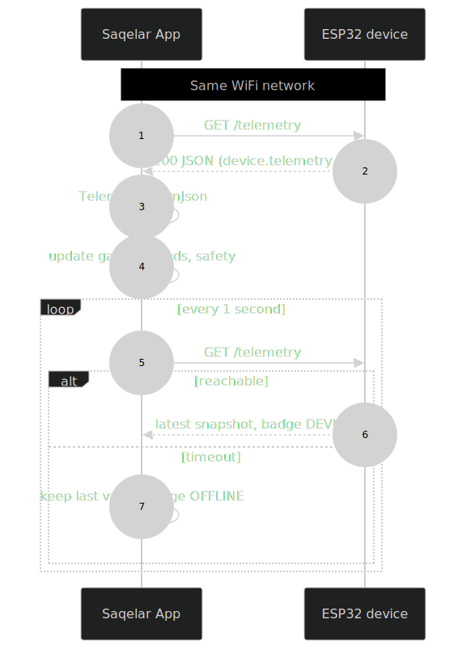

<p align="center">
  
</p>

<h1 align="center">🔗 Integration Guide</h1>

<p align="center">
  
  
  
</p>

How the ESP32 device and the Saqelar app connect into one working system over WiFi, using a single JSON contract.

---

## 📋 Table of contents

| Section | Content |
| :-- | :-- |
| [Data flow](#-data-flow) | The end to end picture |
| [Endpoints](#-endpoints) | Device HTTP API |
| [Sequence](#-sequence) | Request and response timing |
| [Connect steps](#-connect-steps) | Bring it online |
| [Requirements](#-requirements) | What must be true |
| [Troubleshooting](#-troubleshooting) | Common issues |
| [Two way control](#-two-way-control-next) | The next milestone |

---

## 🌊 Data flow

<p align="center">
  
</p>

The device produces telemetry. The app consumes it. There is one shared contract, so when the device is reachable the app shows real data and stops simulating.

---

## 🧪 Endpoints

| Method | Path | Returns |
| :-- | :-- | :-- |
| GET | `/telemetry` | A `device.telemetry.v1` JSON snapshot |
| GET | `/health` | Status, device id, firmware, uptime |

Base URL is `http://<device-ip>` or `http://saqelar.local`. The server listens on port 80. CORS is open for convenience on a trusted LAN.

```bash
# quick check from any machine on the same network
curl http://saqelar.local/health
curl http://saqelar.local/telemetry
```

---

## ⏱️ Sequence

<p align="center">
  
</p>

---

## ✅ Connect steps

1. 🔧 In `Anggie.ino`, set `WIFI_SSID` and `WIFI_PASS`, then flash the ESP32.
2. 🖥️ Open Serial Monitor at 115200 and read the printed IP, for example `192.168.1.50`.
3. 📱 In the app, open Settings from the dashboard gear icon.
4. ⌨️ Enter `http://192.168.1.50` or `http://saqelar.local`, then tap Sambungkan.
5. 🟢 The header badge changes from SIM to DEVICE and the dashboard shows real data.

To go back to the simulator, tap Putuskan or clear the URL.

---

## 📐 Requirements

| Requirement | Why |
| :-- | :-- |
| Same WiFi network | The app reaches the device by local IP |
| 2.4 GHz WiFi | The ESP32 radio does not use 5 GHz |
| WiFi credentials set | The device needs to join before serving HTTP |
| Cleartext HTTP allowed | The LAN link is plain HTTP, already enabled in the app |

---

## 🧯 Troubleshooting

| Symptom | Likely cause | Fix |
| :-- | :-- | :-- |
| Badge stays SIM | URL empty or wrong | Re enter the device URL in Settings |
| Badge shows OFFLINE | Device not reachable | Check WiFi, IP, and that both are on one network |
| `saqelar.local` fails | mDNS not resolving | Use the numeric IP from Serial Monitor |
| Values look frozen | Device rebooted | Wait for reconnect, the app retries each second |

---

## 🔁 Two way control (next)

Today the link is one direction, device to app, for monitoring. The planned upgrade adds a command endpoint so the control panel can change the device:

<p align="center">
  
</p>

Until then the app control panel is advisory and drives the simulator only. Safety logic on the device always keeps final authority over the relay and dimmer.

---

<p align="center">
  <sub>© 2026 PT Surya Inovasi Prioritas (SURIOTA). Author: Gifari Kemal Suryo. MIT License.</sub>
</p>
