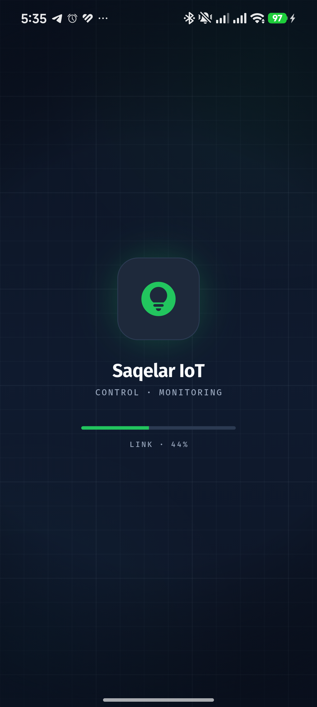
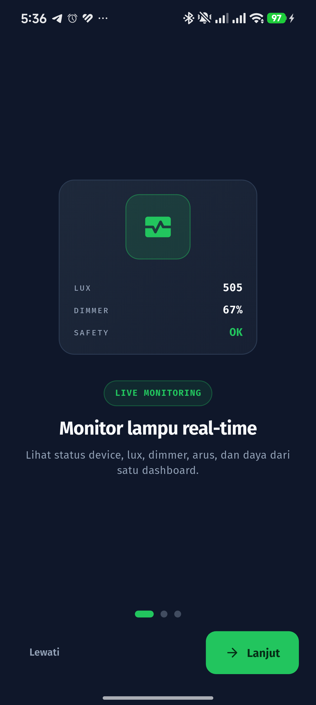
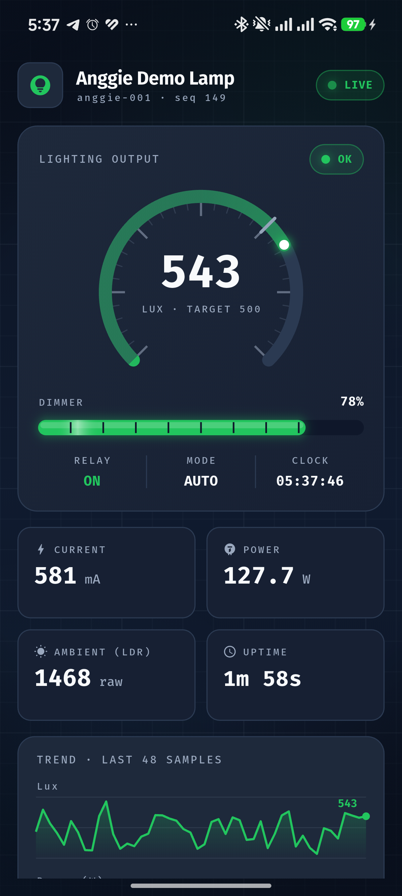
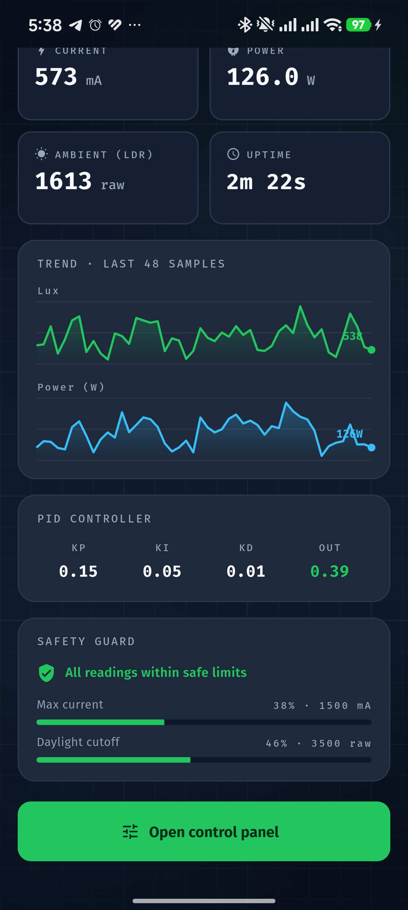
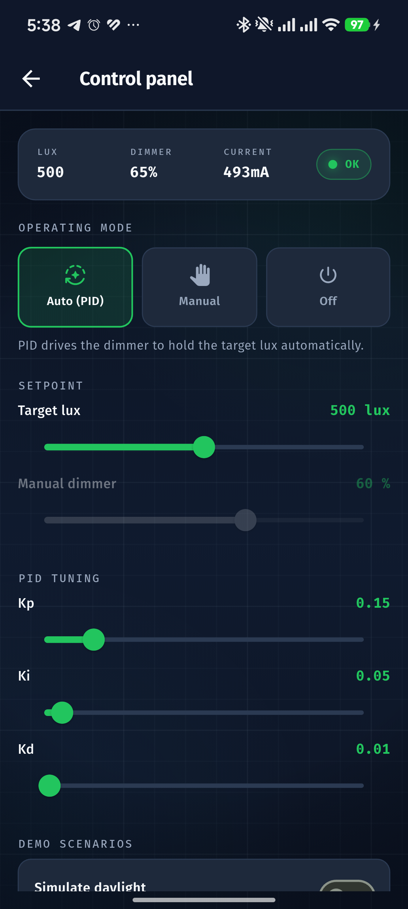
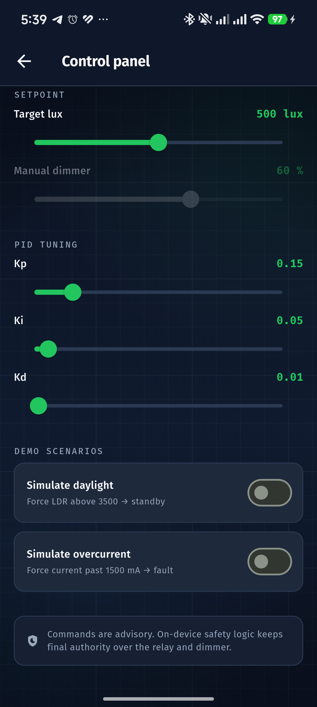
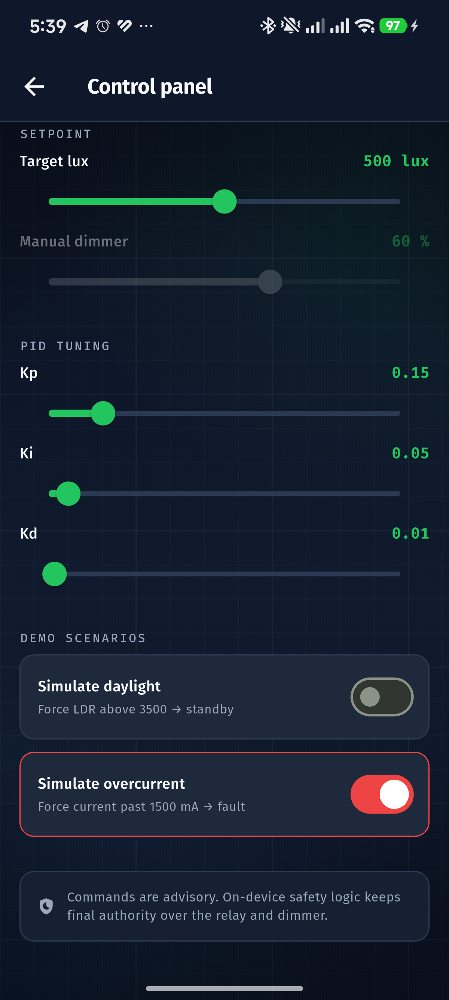
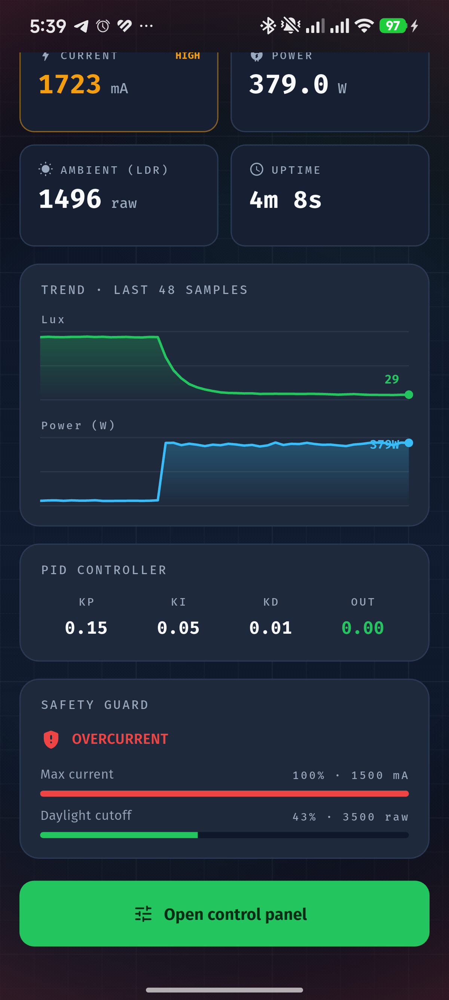
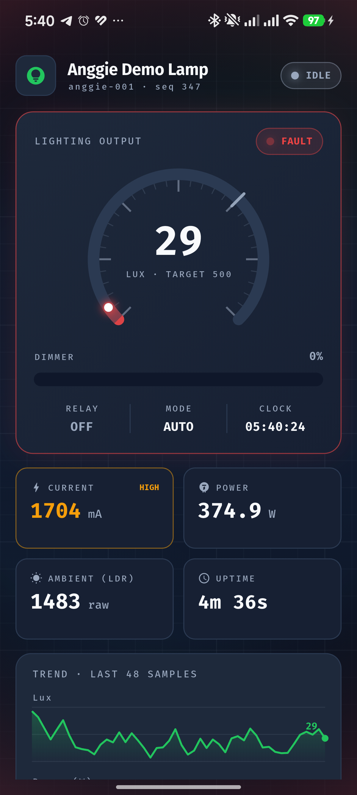

  

<h1 align="center">🖼️ Screen Flow (end to end)</h1>

  
  
  

A full walkthrough of the Saqelar app captured on a Xiaomi 15 running the release build. The app uses the local simulator here, so every screen is reproducible without hardware.

  

---

## 📍 Index

| # | File | Screen |
| :-: | :-- | :-- |
| 1 | `flow1_splash.png` | Splash, boot bar with INIT, LINK, READY |
| 2 | `flow2_ob1.png` | Onboarding 1, live monitoring preview |
| 3 | `flow3_ob2.png` | Onboarding 2, control surface |
| 4 | `flow4_ob3.png` | Onboarding 3, safety first |
| 5 | `flow5_dash_top.png` | Dashboard top, lux gauge and dimmer bar |
| 6 | `flow6_dash_bottom.png` | Dashboard bottom, trends, PID, safety |
| 7 | `flow7_control.png` | Control panel, mode and sliders |
| 8 | `flow8_demo.png` | Demo scenarios and advisory note |
| 9 | `flow9_fault_control.png` | Overcurrent toggle on |
| 10 | `flow10_fault_dash.png` | Fault dashboard, OVERCURRENT |
| 11 | `flow11_fault_hero.png` | Fault hero, red vignette and alarm |

---

## 🟢 Normal flow

| Splash | Onboarding | Dashboard |
| :-: | :-: | :-: |
|  |  |  |

| Dashboard detail | Control panel | Demo scenarios |
| :-: | :-: | :-: |
|  |  |  |

---

## 🔴 Fault alarm takeover

When a fault is simulated, the whole screen reacts: a red vignette, a pulsing fault badge, the relay drops to off, and an alarm sound fires.

| Overcurrent on | Fault dashboard | Fault hero |
| :-: | :-: | :-: |
|  |  |  |

> 🧪 The fault state comes from the Simulate overcurrent toggle in the control panel. It does not persist and resets when the app restarts.

---

  © 2026 PT Surya Inovasi Prioritas (SURIOTA). Author: Gifari Kemal Suryo. MIT License.

